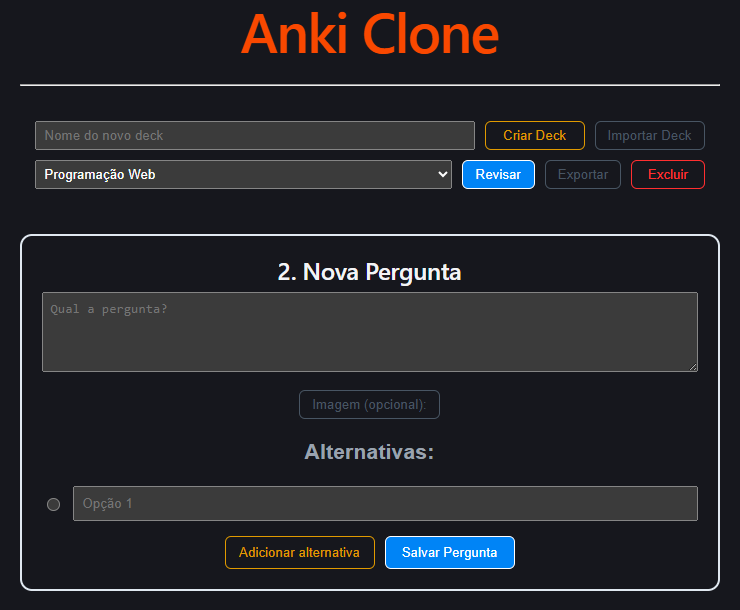
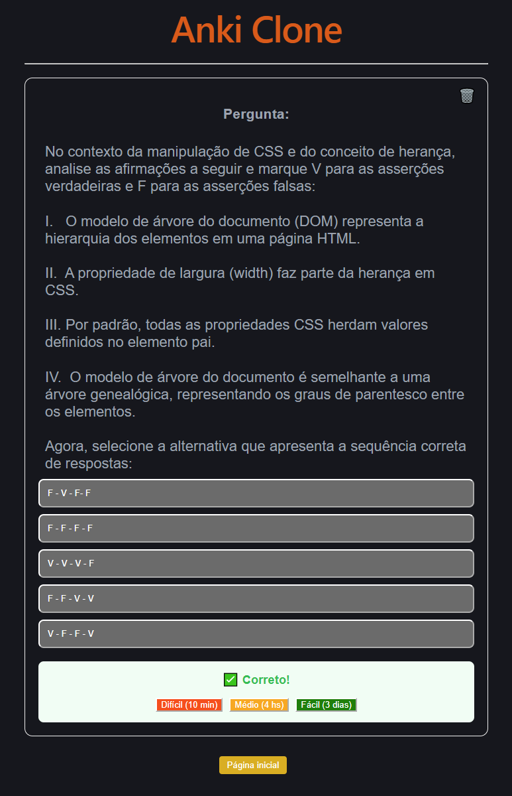

# 🗂️ Mini Anki Clone - React

Este é um projeto de cartões de memorização (Flashcards) baseado no software **Anki**, desenvolvido com **React** e **TypeScript**. O objetivo principal foi criar uma ferramenta personalizada para me auxiliar nos estudos das provas da faculdade, utilizando a técnica de repetição espaçada.

## 🚀 Funcionalidades

- **Gerenciamento de Decks:** Criação e exclusão de baralhos temáticos para diferentes matérias.
- **Criação de Cards:** Adição de perguntas com suporte a múltiplas alternativas.
- **Suporte a Imagens:** Opção de anexar imagens às perguntas (armazenadas em Base64 no LocalStorage).
- **Sistema de Revisão:** Algoritmo simples de repetição espaçada com três níveis de dificuldade:
  - **Difícil:** Revisa em 10 minuto.
  - **Médio:** Revisa em 1 dia.
  - **Fácil:** Revisa em 3 dias.
- **Exclusão em Tempo Real:** Opção de excluir uma pergunta diretamente durante a sessão de estudos.
- **Persistência de Dados:** Todos os dados são salvos no `localStorage` do navegador, permitindo que o progresso não seja perdido ao fechar a aba.

## 🛠️ Tecnologias Utilizadas

- [React](https://reactjs.org/)
- [TypeScript](https://www.typescriptlang.org/)
- [LocalStorage API](https://developer.mozilla.org/pt-BR/docs/Web/API/Window/localStorage)
- [CSS-in-JS (Inline Styles)](https://reactjs.org/docs/dom-elements.html#style)

## Prints do App

   
  
   
  

## Teste agora mesmo o app

Basta acessar o link da página rodando a aplicação:  [Anki Clone](https://charles-da-silva.github.io/Anki_clone/)